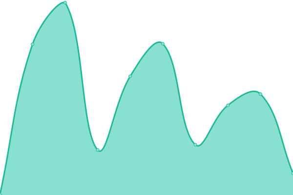

# [📈 Live Status](https://https://digichanges.com/): <!--live status--> **🟧 Partial outage**

This repository contains the open-source uptime monitor and status page for [lucalop](https://https://digichanges.com/), powered by [Upptime](https://github.com/upptime/upptime).

With [Upptime](https://upptime.js.org), you can get your own unlimited and free uptime monitor and status page, powered entirely by a GitHub repository. We use [Issues](https://github.com/lucalop/monitoring/issues) as incident reports, [Actions](https://github.com/lucalop/monitoring/actions) as uptime monitors, and [Pages](https://https://digichanges.com/) for the status page.

<!--start: status pages-->
<!-- This summary is generated by Upptime (https://github.com/upptime/upptime) -->
<!-- Do not edit this manually, your changes will be overwritten -->
<!-- prettier-ignore -->
| URL | Status | History | Response Time | Uptime |
| --- | ------ | ------- | ------------- | ------ |
|  [DGC dev](https://develop.digichanges.com/) | 🟥 Down | [dgc-dev.yml](https://github.com/lucalop/monitoring/commits/HEAD/history/dgc-dev.yml) | 

 0ms
     
 | 

<a href="https://null.github.io/monitoring/history/dgc-dev">0.00%</a>
    

|  [DGC prod](https://digichanges.com/) | 🟩 Up | [dgc-prod.yml](https://github.com/lucalop/monitoring/commits/HEAD/history/dgc-prod.yml) | 

 201ms
     
 | 

<a href="https://null.github.io/monitoring/history/dgc-prod">100.00%</a>
    

<!--end: status pages-->

[**Visit our status website →**](https://https://digichanges.com/)

## 📄 License

- Powered by: [Upptime](https://github.com/upptime/upptime)
- Code: [MIT](./LICENSE) © [lucalop](https://https://digichanges.com/)
- Data in the `./history` directory: [Open Database License](https://opendatacommons.org/licenses/odbl/1-0/)
